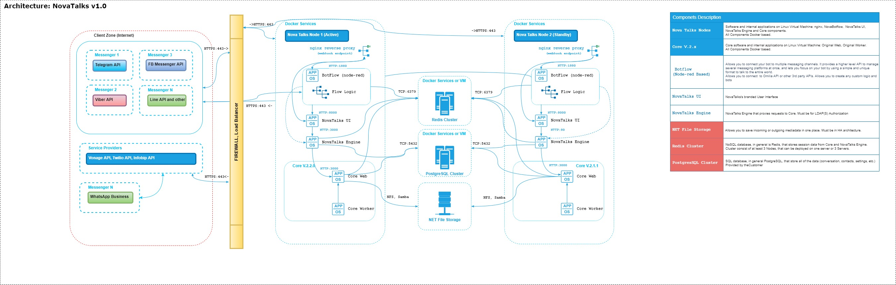

#NovaTalks
###Flowcharts
###Architecture

<figure>  </a> </figure>

###Conversation flow

flowchart LR
  CH1[Conversation Channel 1]-->|custumer message|BF1[Channel Receivers]
  CH2[Conversation Channel 2]-->|custumer message|BF1[Channel Receivers]
  CH3[Conversation Channel ...]-->|custumer message|BF1[Channel Receivers]
  CH4[Conversation Channel N]-->|custumer message|BF1[Channel Receivers]

subgraph Nova.Botflow
  BF1 -->BF2[Throttling]
  BF2 -->|blocked messages|BF3[Possible additional logic]
  BF2 -->|allowed messages|BF4[NovaTalks]
end
subgraph NovaTalks
  BF4 -.-> NT1[Account] 
  NT1 --> NT2[Inbox]
  NT2 --> NT3[Conversation]
  NT3 -.->|events|NT2
end
subgraph Nova.Botflow
  NT2 -.->|events|BF5[BotAgent]
  BF5 -->|conversation events|Redis[Redis] -.->|close on expire event|NT3
  BF5 --> BF6[Flow logic]
  BF6 ==>|outbound messages|BF*[Channel Senders]
  BF6 --> BF7[Transfer on Team\Agent]
  BF7 -.->|conversation events|Redis
  BF7 ==>|outbound messages|BF*
  BF6 --> BF8[Release]
  BF* ==>|outbound message|NT3
end

